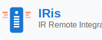

<p align="center">
  
</p>

# IRis IR Remote Integration for Home Assistant

[![GitHub Release][releases-shield]][releases]
[![GitHub Activity][commits-shield]][commits]
[![License][license-shield]](LICENSE)

[![HACS][hacsbadge]][hacs]
[![Project Maintenance][maintenance-shield]][user_profile]

This custom integration allows you to integrate your IRis IR Remote devices with Home Assistant. You can add multiple devices by IP address, monitor their status, send IR commands, and access their web interfaces directly from Home Assistant.

## Features

- **Device Discovery**: Add devices by IP address with automatic validation
- **Multiple Device Support**: Manage multiple IRis IR Remote devices from one integration
- **MQTT Real-time Updates**: Real-time button press detection when MQTT is enabled
- **Individual Button Entities**: Each Arduino button gets its own binary sensor for precise automations
- **Remote Control**: Send IR commands through Home Assistant
- **Status Monitoring**: Monitor device status, connectivity, and learned buttons
- **Web UI Access**: Direct access to device web interfaces
- **Learning Mode**: Start/stop learning mode remotely
- **Dual Update Methods**: HTTP polling (fallback) + MQTT real-time (when available)

## Installation

### HACS (Recommended)

1. Open HACS in your Home Assistant instance
2. Go to "Integrations"
3. Click the three dots in the top right corner and select "Custom repositories"
4. Add this repository URL: `https://github.com/jhcooke98/IRis`
5. Select "Integration" as the category
6. Click "Add"
7. Find "IRis IR Remote Integration" in the list and install it
8. Restart Home Assistant

### Manual Installation

1. Using the tool of choice open the directory (folder) for your HA configuration (where you find `configuration.yaml`)
2. If you do not have a `custom_components` directory (folder) there, you need to create it
3. In the `custom_components` directory (folder) create a new folder called `iris_ir_remote`
4. Download _all_ the files from the `custom_components/iris_ir_remote/` directory (folder) in this repository
5. Place the files you downloaded in the new directory (folder) you created
6. Restart Home Assistant
7. In the HA UI go to "Configuration" -> "Integrations" click "+" and search for "IRis IR Remote Integration"

## Configuration

### Adding a Device

1. In Home Assistant, go to **Configuration** → **Integrations**
2. Click **Add Integration**
3. Search for **IRis IR Remote Integration**
4. Enter your device details:
   - **Host/IP Address**: The IP address of your IRis device (e.g., `192.168.1.100`)
   - **Port**: The port number (default: `80`)
   - **Device Name**: A friendly name for the device (optional)

### Options

After adding a device, you can configure:
- **Update Interval**: How often to poll the device for status updates (default: 30 seconds)

## Entities Created

For each device, the integration creates the following entities:

### Remote Entities
- **Main Remote** (`remote.iris_ir_remote_xxx`): Controls the entire device
- **Individual Remotes** (`remote.remote_name_xxx`): One for each learned remote protocol

### Sensors
- **Last Button** (`sensor.iris_last_button_xxx`): Shows the last button pressed (MQTT real-time when available)
- **Last Button Fallback** (`sensor.iris_last_button_fallback_xxx`): HTTP polling backup for last button
- **Uptime** (`sensor.iris_uptime_xxx`): Device uptime
- **Button Count** (`sensor.iris_button_count_xxx`): Number of learned buttons
- **IP Address** (`sensor.iris_ip_address_xxx`): Device IP address
- **Free Memory** (`sensor.iris_free_memory_xxx`): Available memory in bytes

### Binary Sensors
- **WiFi Connected** (`binary_sensor.iris_wifi_connected_xxx`): WiFi connection status
- **MQTT Connected** (`binary_sensor.iris_mqtt_connected_xxx`): MQTT connection status
- **Learning Mode** (`binary_sensor.iris_learning_mode_xxx`): Learning mode status
- **Individual Button Entities** (`binary_sensor.iris_button_{name}_xxx`): One for each button (MQTT only)

### Individual Button Entities (New in v2.2.0)

When MQTT is enabled, the integration automatically creates individual binary sensor entities for each button defined in your Arduino device. These entities:

- Turn **ON** momentarily when the specific button is pressed
- Automatically turn **OFF** after 2 seconds
- Include availability based on device online/offline status
- Support precise automations for each button

**Example Entities:**
- `binary_sensor.iris_button_red_192_168_1_100_80`
- `binary_sensor.iris_button_green_192_168_1_100_80`
- `binary_sensor.iris_button_yellow_192_168_1_100_80`
- `binary_sensor.iris_button_blue_192_168_1_100_80`

See [BUTTON_ENTITIES_GUIDE.md](BUTTON_ENTITIES_GUIDE.md) for detailed usage examples.

## Services

The integration provides several services for controlling your devices:

### `iris_ir_remote.send_button`
Send a button command to the device.

**Parameters:**
- `entity_id`: The remote entity to target
- `button`: Name of the button to send

**Example:**
```yaml
service: iris_ir_remote.send_button
target:
  entity_id: remote.iris_ir_remote_192_168_1_100
data:
  button: "POWER"
```

### `iris_ir_remote.start_learning`
Start learning mode on the device.

**Parameters:**
- `entity_id`: The remote entity to target

### `iris_ir_remote.stop_learning`
Stop learning mode on the device.

**Parameters:**
- `entity_id`: The remote entity to target

### `iris_ir_remote.restart_device`
Restart the device.

**Parameters:**
- `entity_id`: The remote entity to target

### `iris_ir_remote.open_web_ui`
Open the device's web interface. This creates an event that frontend integrations can use to open the web UI.

**Parameters:**
- `entity_id`: The remote entity to target

## Using Remote Entities

### Sending Commands

You can send IR commands using the standard Home Assistant remote service:

```yaml
service: remote.send_command
target:
  entity_id: remote.sony_tv_192_168_1_100
data:
  command: ["POWER", "VOL_UP", "CH_UP"]
```

### Learning Mode

Use the remote entity's turn_on/turn_off to control learning mode:

```yaml
# Start learning mode
service: remote.turn_on
target:
  entity_id: remote.iris_ir_remote_192_168_1_100

# Stop learning mode  
service: remote.turn_off
target:
  entity_id: remote.iris_ir_remote_192_168_1_100
```

## Automation Examples

### Individual Button Automations (Recommended)

With the new button entities, you can create precise automations for each button:

```yaml
automation:
  - alias: "Red Button - Living Room Lights"
    trigger:
      - platform: state
        entity_id: binary_sensor.iris_button_red_192_168_1_100_80
        to: "on"
    action:
      - service: light.turn_on
        target:
          entity_id: light.living_room_lights
        data:
          color_name: "red"
          brightness: 255

  - alias: "Green Button - Garden Lights"
    trigger:
      - platform: state
        entity_id: binary_sensor.iris_button_green_192_168_1_100_80
        to: "on"
    action:
      - service: light.turn_on
        target:
          entity_id: light.garden_lights
        data:
          color_name: "green"
```

### Legacy: Notify when a button is pressed

```yaml
automation:
  - alias: "IR Button Pressed Notification"
    trigger:
      - platform: state
        entity_id: sensor.iris_last_button_192_168_1_100
    condition:
      - condition: template
        value_template: "{{ trigger.to_state.state != 'None' }}"
    action:
      - service: notify.mobile_app
        data:
          message: "IR Button pressed: {{ trigger.to_state.state }}"
```

### Auto-start learning mode

```yaml
automation:
  - alias: "Start IR Learning Mode"
    trigger:
      - platform: state
        entity_id: input_boolean.ir_learning_mode
        to: "on"
    action:
      - service: iris_ir_remote.start_learning
        target:
          entity_id: remote.iris_ir_remote_192_168_1_100
```

### Monitor device connectivity

```yaml
automation:
  - alias: "IR Device Disconnected"
    trigger:
      - platform: state
        entity_id: binary_sensor.iris_wifi_connected_192_168_1_100
        to: "off"
        for: "00:01:00"
    action:
      - service: notify.mobile_app
        data:
          title: "IR Device Offline"
          message: "IRis device at 192.168.1.100 has gone offline"
```

## Lovelace UI Examples

### Basic Device Control Card

```yaml
type: entities
title: IRis IR Remote
entities:
  - entity: remote.iris_ir_remote_192_168_1_100
    name: Main Remote
  - entity: sensor.iris_last_button_192_168_1_100
    name: Last Button
  - entity: sensor.iris_uptime_192_168_1_100
    name: Uptime
  - entity: binary_sensor.iris_wifi_connected_192_168_1_100
    name: WiFi Status
  - entity: binary_sensor.iris_mqtt_connected_192_168_1_100
    name: MQTT Status
```

### Button Grid Card

```yaml
type: grid
columns: 3
cards:
  - type: button
    tap_action:
      action: call-service
      service: iris_ir_remote.send_button
      target:
        entity_id: remote.sony_tv_192_168_1_100
      service_data:
        button: "POWER"
    name: Power
    icon: mdi:power
  - type: button
    tap_action:
      action: call-service
      service: iris_ir_remote.send_button
      target:
        entity_id: remote.sony_tv_192_168_1_100
      service_data:
        button: "VOL_UP"
    name: Vol +
    icon: mdi:volume-plus
  - type: button
    tap_action:
      action: call-service
      service: iris_ir_remote.send_button
      target:
        entity_id: remote.sony_tv_192_168_1_100
      service_data:
        button: "VOL_DOWN"
    name: Vol -
    icon: mdi:volume-minus
```

## Web UI Access

Each device entity includes a `configuration_url` that points to the device's web interface. You can:

1. Click on the device in the Integrations page to access the web UI
2. Use the `iris_ir_remote.open_web_ui` service
3. Access the URL directly from the device attributes

## Troubleshooting

### Device Not Found
- Verify the IP address and port are correct
- Ensure the device is powered on and connected to WiFi
- Check that port 80 is accessible (no firewall blocking)

### Connection Errors
- The device may be in AP mode - check WiFi configuration
- Network connectivity issues between Home Assistant and the device
- Device may be restarting or updating

### Missing Entities
- Restart Home Assistant after installation
- Check the logs for any error messages
- Verify the device is responding to API calls

### Services Not Working
- Ensure the target entity_id is correct
- Check that the device is online and accessible
- Verify button names match exactly (case-sensitive)

## Development

This integration follows Home Assistant's development standards and includes:

- Config flow for easy setup
- Options flow for configuration
- Proper error handling and logging
- Entity registry integration
- Device registry integration
- Translation support

## Support

For issues, feature requests, or contributions, please visit the GitHub repository.

## License

This integration is provided under the MIT License.

---

[releases-shield]: https://img.shields.io/github/release/jhcooke98/IRis.svg?style=for-the-badge
[releases]: https://github.com/jhcooke98/IRis/releases
[commits-shield]: https://img.shields.io/github/commit-activity/y/jhcooke98/IRis.svg?style=for-the-badge
[commits]: https://github.com/jhcooke98/IRis/commits/main
[hacs]: https://github.com/hacs/integration
[hacsbadge]: https://img.shields.io/badge/HACS-Custom-orange.svg?style=for-the-badge
[license-shield]: https://img.shields.io/github/license/jhcooke98/IRis.svg?style=for-the-badge
[maintenance-shield]: https://img.shields.io/badge/maintainer-%40jhcooke98-blue.svg?style=for-the-badge
[user_profile]: https://github.com/jhcooke98
